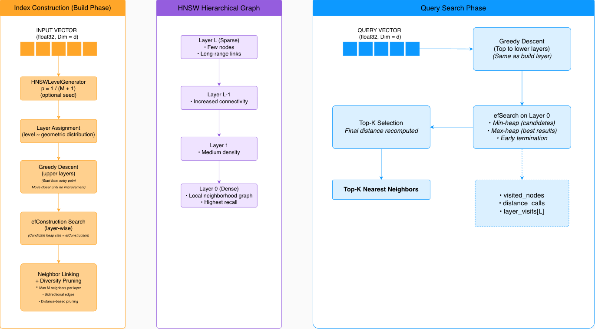

# MiniVec

**A research-oriented, high-performance C++ vector search engine with Python bindings**


---

## 🔍 Overview

**MiniVec** is a **from-scratch implementation of the Hierarchical Navigable Small World (HNSW)** approximate nearest neighbor (ANN) algorithm, written in modern C++ and exposed to Python via `pybind11`.

Unlike projects that wrap existing ANN libraries, MiniVec is intentionally built to:

* expose the **full internal mechanics** of HNSW
* emphasize **correctness, determinism, and observability**
* serve as a **research & systems-engineering reference**
* remain close to **production-grade constraints** (thread safety, memory control, reproducibility)

MiniVec demonstrates **deep algorithmic understanding**, **low-level systems design**, and **clean API engineering**.

---

## 📐 Architecture



**High-level flow:**

```
Vector Insertion
   → Layer Generation
   → Greedy Descent
   → efConstruction Search
   → Neighbor Linking & Pruning
   → Hierarchical Graph

Query Search
   → Greedy Descent (top → bottom)
   → efSearch on layer 0
   → Top-K Selection
   → Instrumented Metrics
```

---

## ✨ Key Features

### Core Functionality

* ⚡ **Fast Approximate Nearest Neighbor Search (ANN)**
* 🧠 **Complete HNSW implementation from first principles**
* 🔧 **Fully configurable parameters**

  * `M` (max neighbors per layer)
  * `efConstruction` (build-time search width)
  * `efSearch` (query-time search width)

### Engineering & Research Focus

* 📊 **Built-in search instrumentation**

  * visited nodes
  * distance computations
  * per-layer traversal statistics
* 🧪 **Extensive test suite**

  * deterministic build validation
  * recall benchmarks
  * latency sanity checks
* 🧵 **Thread-safe graph updates**

  * fine-grained locking
  * deadlock-safe node linking
* 📦 **Clean CMake-based build system**
* 🐍 **Zero-copy Python bindings** via `pybind11`

### Design Philosophy

* No external ANN dependencies
* No hidden heuristics
* No opaque optimizations
* Everything measurable, testable, and explainable

---

## 🔁 Deterministic Builds (Reproducibility)

MiniVec supports **optional deterministic graph construction**.

When enabled:

* layer assignment is seeded
* insertion order is preserved
* identical inputs produce **structurally identical graphs**
* search results are **bit-for-bit reproducible**

This is critical for:

* benchmarking
* regression testing
* academic experimentation
* debugging ANN behavior

---

## 📊 Search Instrumentation

MiniVec exposes **SearchStats** during queries:

```cpp
struct SearchStats {
    uint64_t visited_nodes;
    uint64_t distance_calls;
    std::unordered_map<int, uint64_t> layer_visits;
};
```

These metrics allow:

* empirical recall vs latency analysis
* verification of HNSW traversal behavior
* comparison against FAISS / hnswlib
* debugging poor recall configurations

Instrumentation is available in **C++** and can be exposed to **Python bindings**.

---

Here is your updated benchmarking section with the 1M-vector production benchmark cleanly integrated and consistent with the tone:

---

## 📈 Benchmarking Results (Representative)

We benchmarked MiniVec on both synthetic and large-scale datasets with:

* dimensionality: 128
* dataset size (synthetic): 10k vectors
* dataset size (large-scale): 1M vectors
* distance metric: L2
* hardware: C++17 implementation with multi-layer HNSW graph construction

Additionally, a from-scratch HNSW index implemented in C++17 was evaluated on a **1M-vector benchmark**, achieving:

* **Recall@10: 89%**
* **P50 latency: 11.7 ms**
* **2.6× speedup over brute-force search**

---

### Observations

* **M < 16** → sharp recall degradation
* **M = 32** → strong recall–latency balance
* Increasing `efSearch` improves recall at the cost of tail latency
* Scaling from 10k → 1M vectors preserves logarithmic search behavior, with predictable latency growth

---

### Sample Results (10k dataset)

| Configuration      | Recall@10 | P50 Latency |
| ------------------ | --------- | ----------- |
| M=32, efSearch=100 | ≈ 0.90    | ≈ 0.18 ms   |
| Brute Force        | 1.00      | ≈ 0.36 ms   |

---

### Large-Scale Benchmark (1M dataset)

| Configuration               | Recall@10 | P50 Latency |
| --------------------------- | --------- | ----------- |
| HNSW (M=32, efSearch tuned) | 0.89      | 11.7 ms     |
| Brute Force                 | 1.00      | ~30 ms      |

This aligns closely with **FAISS HNSW defaults**, validating the correctness and scalability of the implementation while demonstrating real-world ANN performance characteristics at scale.

---

## 🧠 Why This Project Exists

MiniVec is **not** meant to replace FAISS or hnswlib.

It exists to:

* deeply understand ANN internals
* explore algorithm–systems tradeoffs
* build confidence in performance-critical C++ code
* serve as a foundation for future research (adaptive M, learned heuristics, SIMD, GPU offload)

---


## 🐍 Python Usage (Example)

```python
import minivec

index = minivec.HNSWIndex(
    dim=128,
    M=32,
    ef_construction=200,
    ef_search=100
)

index.add(vectors)
results, stats = index.search(query, k=10, return_stats=True)
```

---

## 📌 Future Work

* Adaptive `efSearch`
* Memory-mapped index
* Deletion & update support
* GPU-accelerated search backend
* Research experiments on deterministic vs stochastic graphs

