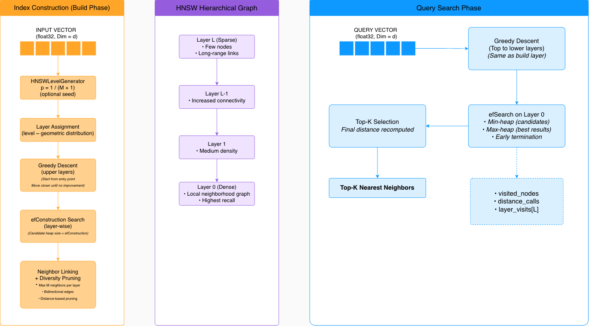

# MiniVec

**A research-oriented C++ vector search implementation with Python bindings**


**Status: pre-alpha.** APIs and performance characteristics may change.

---

## 🔍 Overview

**MiniVec** is a research and learning reference for the Hierarchical Navigable Small World (HNSW) approximate nearest neighbor (ANN) algorithm. It is implemented in **C++17** and exposed to Python via **pybind11**.

MiniVec is intended for students, researchers, and engineers who want to inspect how an HNSW index is built and searched, then experiment with its parameters and implementation. The project prioritizes:

- exposing the **internal mechanics of HNSW**
- make algorithm behavior observable through search statistics
- support reproducible, controlled experiments
- provide a small C++ core with a practical Python interface

The current scope is a single-process, in-memory HNSW index for fixed-size float vectors. The Python API and performance profile are experimental; persistence, deletion, and index updates are not currently supported. Use the project to study and evaluate implementation choices, and consult the benchmark section before drawing performance conclusions.

---

## 🚀 Quick Start

Clone the repository:

```bash
git clone https://github.com/AyushSolanki-17/MiniVec.git
cd MiniVec
````

---

## ⚙️ Installation

Install the Python package from a source checkout with:

```bash
python -m pip install .
```

This builds the C++ extension for the active Python interpreter. A C++17
compiler and CMake 3.18 or newer are required; pip installs the Python build
dependencies, including pybind11. Prebuilt platform wheels are not published
yet.

### Requirements

* C++17 compiler (GCC / Clang)
* CMake ≥ 3.18
* Python 3 with development headers when `MINIVEC_BUILD_PYTHON=ON` (the default); CMake fetches pybind11
* GoogleTest and Google Benchmark are fetched when their build options are enabled (both default to `ON`)

---

### Build C++ Library

```bash
./scripts/build/build.sh
```

To build only the C++ library without Python, test, or benchmark dependencies:

```bash
cmake -S cpp -B build/cpp-core \
  -DMINIVEC_BUILD_PYTHON=OFF \
  -DMINIVEC_BUILD_TESTS=OFF \
  -DMINIVEC_BUILD_BENCHMARKS=OFF
cmake --build build/cpp-core
```

The default CMake configuration builds the Python extension, C++ tests, and benchmark target. Turn off the corresponding `MINIVEC_BUILD_*` options when configuring to omit those targets. On Windows, `scripts/build/build.ps1` runs the default Release build.

---

### Run Python Tests

```bash
PYTHONPATH=build:$PYTHONPATH python -m pytest
```

Build the extension with the same Python interpreter used to run tests. CMake creates `minivec_cpp` in `build/`; the command above makes it importable to the Python package and runs the Python tests. To run the C++ tests after building, use `ctest --test-dir build --output-on-failure`.

## Repository layout

```text
cpp/                    C++ library, public headers, tests, and benchmarks
minivec/                Python API wrapper
tests/                  Python tests
docs/                   Architecture and project documentation
scripts/build/          Release, debug, test, benchmark, and Windows build entry points
scripts/                Supporting development utilities
```

Build output stays in root-level `build*` directories and is not source code.

---

## 📐 Architecture



High-level workflow:

### Index Construction

```
Vector Insertion
   → Layer Assignment
   → Greedy Descent
   → efConstruction Candidate Search
   → Neighbor Selection & Pruning
   → Hierarchical Graph Update
```

### Query Search

```
Query Vector
   → Greedy Descent (top layers)
   → efSearch Exploration (bottom layer)
   → Candidate Heap
   → Top-K Nearest Neighbors
```

The implementation uses a multi-layer proximity graph inspired by HNSW. Search cost depends on graph structure, parameters, and data; this repository does not claim logarithmic scaling.

---

## ✨ Key Features

### Core Functionality

* ⚡ **Approximate Nearest Neighbor Search**
* 🧠 **Full HNSW implementation from first principles**
* 🔧 Configurable parameters:

  * `M` — maximum neighbors per upper-layer node (layer 0 allows up to `2M`)
  * `efConstruction` — graph build search width
  * `efSearch` — query search width

---

### Systems Engineering Focus

* 📊 **Search instrumentation**

  * visited nodes
  * distance computations
  * layer traversal statistics

* 🧵 **Thread-safe graph updates**

  * fine-grained locking
  * deadlock-safe neighbor linking

* 📦 **CMake-based build system**

* 🐍 **NumPy-based Python bindings via pybind11**, including batch insert and search

---

### Design Philosophy

MiniVec intentionally avoids hidden optimizations.

Goals:

* transparency
* reproducibility
* inspectability
* algorithmic correctness

Everything is measurable and observable.

---

## 🔁 Deterministic Graph Construction

The C++ index supports deterministic serial builds when deterministic level generation is enabled and a seed is supplied.

With that configuration:

* layer assignment is seeded
* inserting vectors in the same order preserves that order
* graph structure becomes reproducible
* repeated serial builds with the same seed and insertion order produce the same graph

This is useful for:

* benchmarking
* regression testing
* academic experimentation
* debugging ANN behavior

---

## 📊 Search Instrumentation

MiniVec exposes runtime search metrics:

```cpp
struct SearchStats {
    uint64_t visited_nodes;
    uint64_t distance_calls;
    std::unordered_map<int, uint64_t> layer_visits;
};
```

These statistics enable:

* recall vs latency analysis
* algorithm debugging
* performance comparisons when paired with reproducible benchmarks
* tuning search parameters

Instrumentation is available in **C++** and through the Python `search_with_stats` method.

---

## 📈 Benchmarking

No reproducible benchmark results are currently published. The benchmark target is in `cpp/benchmarks/`; compare results only after recording dataset, parameters, hardware, build options, and baseline implementation.

---

## 🐍 Python Usage

Example usage from Python:

```python
import minivec
import numpy as np

vectors = np.random.default_rng(42).normal(size=(100, 128)).astype(np.float32)
query = vectors[0]
queries = vectors[:5]

index = minivec.MiniVecIndex(
    dim=128,
    M=32,
    ef_construction=200,
    ef_search=100
)

ids = index.add_many(vectors)
results = index.search(query, k=10)
batch_results = index.search_many(queries, k=10)

results, stats = index.search_with_stats(query, k=10)
```

`MiniVecIndex` also provides `add_many(vectors)` and `search_many(queries, k)` for 2D NumPy arrays. The constructor accepts `distance` and `final_distance`; supported names are `l2_squared`, `l2`, `cosine`, and `inner_product`. Set `deterministic=True` and a fixed `seed` to make serial graph builds repeatable for the same insertion order. `search_with_stats` returns `(results, stats)`, where stats includes visited nodes, distance calls, and per-layer visits. The `size`, `entry_point`, and `max_level` properties expose index state.

### Input and edge-case behavior

The constructor requires positive integer values for `dim`, `M`, `ef_construction`, and `ef_search`. Vector and query inputs are converted to `float32` and must have the configured dimension; all values must be finite. Batch methods accept arrays shaped `(n, dim)`, including empty batches. Search `k` must be a non-negative integer: `k=0` returns no results, searching an empty index returns no results, and `k` larger than the index size returns all available results. Result lists are ordered by increasing distance.

---

## 🧠 Project Scope

MiniVec gives readers a compact codebase for studying graph construction, approximate search, distance metrics, concurrency, and recall/latency tradeoffs. Search instrumentation and deterministic serial builds support repeatable experiments. The project does not yet provide persistence, deletion, update operations, distributed search, or prebuilt platform wheels.

---

## 🔮 Future Work

Possible research directions:

* adaptive `efSearch`
* memory-mapped indices
* deletion and update support
* GPU search backend
* research experiments on deterministic vs stochastic graph builds

---

## 🙌 Acknowledgements

This project is inspired by the original **HNSW paper**:

> *Efficient and robust approximate nearest neighbor search using Hierarchical Navigable Small World graphs*
> Yu. A. Malkov, D. A. Yashunin (2018)

and by open-source implementations such as:

* FAISS
* hnswlib

MiniVec aims to provide a **minimal, transparent implementation for learning and experimentation**.
