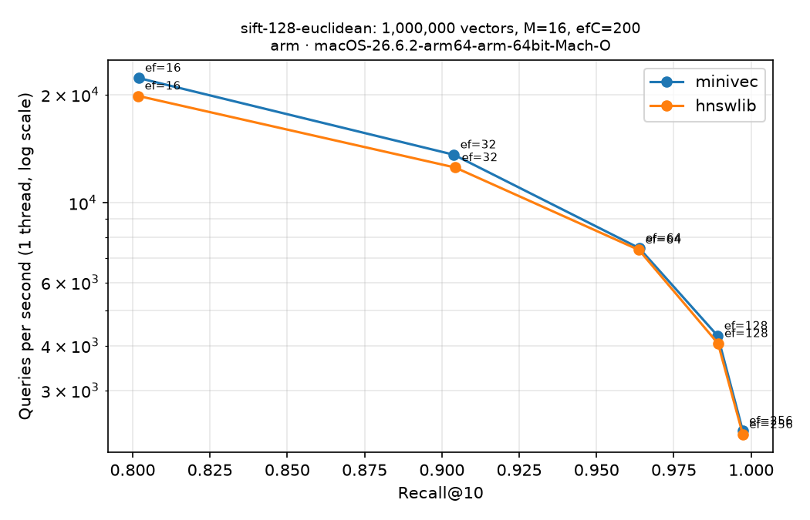

# Reproducible recall and latency benchmark

`scripts/benchmark_ann.py` builds one deterministic index, sweeps `ef_search`
over the same index, and compares top-k results with exact neighbors. It reports
build time, peak process memory, recall@k, per-query p50/p95/p99 latency and
single-thread QPS. The JSON output records the source revision and software
environment; `--csv` writes one row per `ef_search` value.

## Real datasets (ann-benchmarks)

```bash
python -m pip install ".[bench]"          # adds h5py, hnswlib, matplotlib
python scripts/benchmark_ann.py --dataset sift-128-euclidean \
    --M 16 --ef-construction 200 --ef-search 16 32 64 128 256 \
    --output data/bench/sift1m.json --csv data/bench/sift1m.csv
```

Supported datasets are `sift-128-euclidean` and `glove-100-angular` (vectors
are L2-normalized so squared-L2 ranking equals cosine ranking). Files are
downloaded once from ann-benchmarks.com into `data/ann/` (about 500 MB each)
and recall uses the published ground truth. `--limit-queries N` uses the first
N queries; `--limit-train N` indexes the first N vectors and recomputes exact
ground truth for that subset.

### SIFT1M results

One run on 2026-10-10: Apple M5 (16 GB), macOS 26.6, Apple clang 21, Release
build, Python 3.14, NumPy 2.5, hnswlib 0.8.0. 1,000,000 base vectors, 10,000
queries, k=10, `M=16`, `ef_construction=200`, deterministic levels (seed 42).
`--engines minivec,hnswlib` builds both libraries on identical data with the
same parameters, one build thread and one query per call on one thread, using
the same timing loop; both latencies include Python call overhead. Raw data:
[2026-10-10-sift1m-compare.json](benchmark-results/2026-10-10-sift1m-compare.json).



| ef_search | MiniVec Recall@10 | MiniVec p50 / p99 (ms) | MiniVec QPS | hnswlib Recall@10 | hnswlib QPS |
| ---: | ---: | ---: | ---: | ---: | ---: |
| 16 | 0.802 | 0.044 / 0.071 | 22,260 | 0.802 | 19,842 |
| 32 | 0.904 | 0.074 / 0.108 | 13,606 | 0.904 | 12,533 |
| 64 | 0.964 | 0.131 / 0.363 | 7,473 | 0.964 | 7,386 |
| 128 | 0.989 | 0.240 / 0.327 | 4,255 | 0.989 | 4,053 |
| 256 | 0.997 | 0.441 / 0.635 | 2,314 | 0.997 | 2,259 |

Index construction took 285 s for MiniVec and 344 s for hnswlib. MiniVec's peak
process memory grew from 561 MiB (dataset loaded) to 1,263 MiB after the build.
The two graphs reach the same recall at each `ef_search`; single-thread QPS
differences of this size are within run-to-run noise on a laptop. Plot a report
with `python scripts/plot_recall_qps.py report.json -o plot.png`.

## Synthetic data

Without `--dataset`, the script creates seeded Gaussian vectors and independent
queries (`--count`, `--dim`, `--queries`, `--seed`) and measures a NumPy
exact-search baseline alongside MiniVec:

```bash
python -m pip install .
python scripts/benchmark_ann.py --output benchmark-results/run.json
```

### Recorded synthetic example

The checked-in [JSON result](benchmark-results/2026-10-09-local.json) is one
local run on Apple silicon using 5,000 vectors of 128 dimensions and 100
queries. MiniVec used `M=32` and `ef_construction=200`; data and level
generation used seed 42.

| ef_search | Recall@10 | MiniVec p50 (ms/query) | MiniVec p95 (ms/query) |
| ---: | ---: | ---: | ---: |
| 50 | 0.958 | 0.047 | 0.051 |
| 100 | 0.985 | 0.074 | 0.078 |
| 200 | 0.997 | 0.114 | 0.121 |

Index construction took 3.422 seconds. The exact NumPy baseline in this run had 0.283 ms p50 and 0.322 ms p95 per
query. This is a small synthetic example, not a general performance claim:
results depend on the dataset, Python and NumPy versions, compiler, and machine.
The baseline also measures NumPy's vectorized CPU implementation, while MiniVec
reports the complete Python-to-C++ call for one query.
